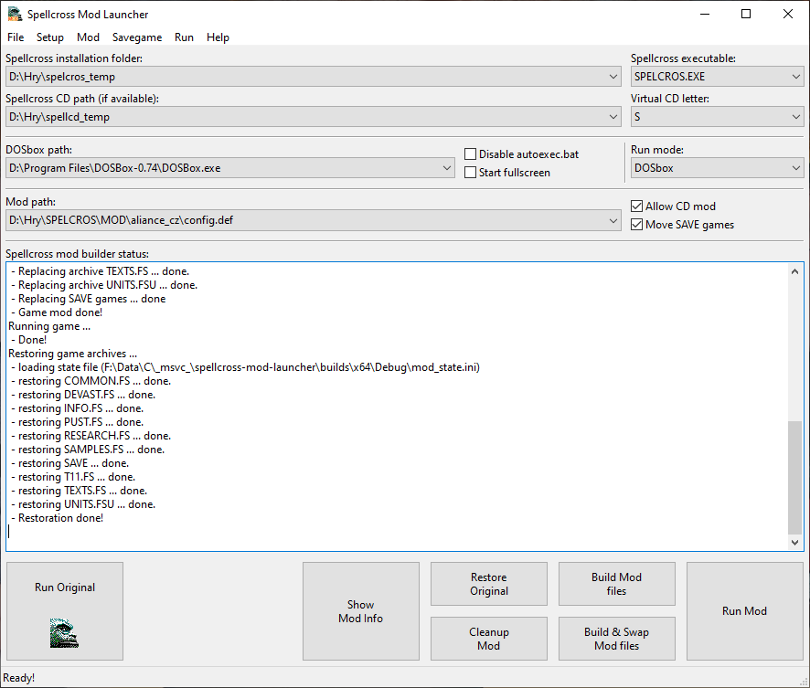

# Spellcross Mod Launcher

Simple tool for runtime building of game archives mods and launching Spellcross game.

## What is it and why is it?

Spellcross is my favourite oldie game. Some 20 years ago I started playing with the game data archives (*.FS and *.FSU) and trying to decide and modify them. See some of my early experiments are 
[here](https://spellcross.kvalitne.cz/index.html) (sorry, Czech language only). 

Howver, when I wanted to make actual mods involving changes in several game archives, it has become a bit impractical to do so manually by unpacking, editing and repacking each archive. The situation became even more convoluted when I had multiple different mods. So, I made a [tool](https://spellcross.kvalitne.cz/mod/spell_mod_builder.html) that can build modified game archives on runtime based on definition file from original game files and additional user files to be added/modified to them. 
Than, it can replace original game archives with modded ones, launch the game and of course restore original game archives after the game is finished. 
Original tool was very messy and made in Borland VCL C++ which is obsolete. So I spent few days and made the whole thing from a scratch again in MSVC C++ with wxWidgets GUI (in theory prepared for multiplatform builds).

## Builds

Not published yet because it is not finished and tested and it has no help yet.

                                 
## License
The tool is distributed under [MIT license](./LICENSE.txt). 
  
  
