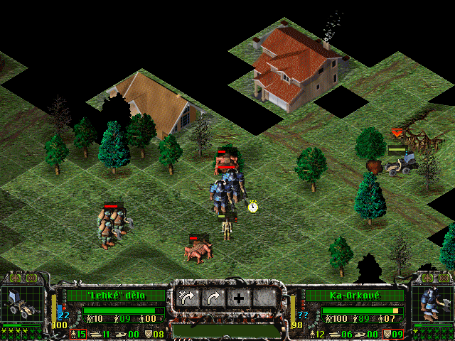

# Spellcross Mod Launcher

Simple tool for runtime building of game archives mods and launching Spellcross game.

## What is it and why is it?

Spellcross is my favourite oldie game. Some 20 years ago I started playing with the game data archives (*.FS and *.FSU) and trying to decode and modify them. See some of my early experiments are 
[here](https://spellcross.kvalitne.cz/index.html) (sorry, Czech language only). 

Howver, when I wanted to make actual mods involving changes in several game archives, it has become a bit impractical to do so manually by unpacking, editing files and repacking each archive. The situation became even more convoluted when I had multiple different mods. So, I made a [tool](https://spellcross.kvalitne.cz/mod/spell_mod_builder.html) that can build modified game archives on runtime based on definition file from original game files and additional user files to be added/modified to them. 
Than, it can replaces original game archives with modded ones, launch the game and of course restores original game archives after the game is finished. 
Original tool was very messy and made in Borland VCL C++ which is obsolete. So I spent few days and made the whole thing from a scratch again in MSVC C++ with wxWidgets GUI (in theory prepared for multiplatform builds).

## What can it do?

- Current version is able to build all game archives based on definition files same as the old tool.
- It can swap the game archives with modded ones and restore them back.
- It can also move SAVE games folder along with the modded archives, so you can have separate set of saves for each mod not colliding with each other.
- It generates game launch batch files for either DOSbox mode or native Win32 mode. The Win32 is now obsolete but if compiled for x86 it can be run in e.g. 32bit WinXP which still has NTDVM emulator integrated.
- It can directly launch the game via DOSbox or Win32 modes - one click operation together with or without mod.
- It can make fast backup and restore of temporary WORKDIR save that is useful when you play some of the bloody mission where loss of special unit terminates mission without option to load (we all know those missions right? :-).
- It has simple SAVE game backup manager to make and restore backups of whole save games set just in case...

## Builds

Not published yet because it is not finished and tested and it has no help yet.

                                 
## License
The tool is distributed under [MIT license](./LICENSE.txt). 
  
  
