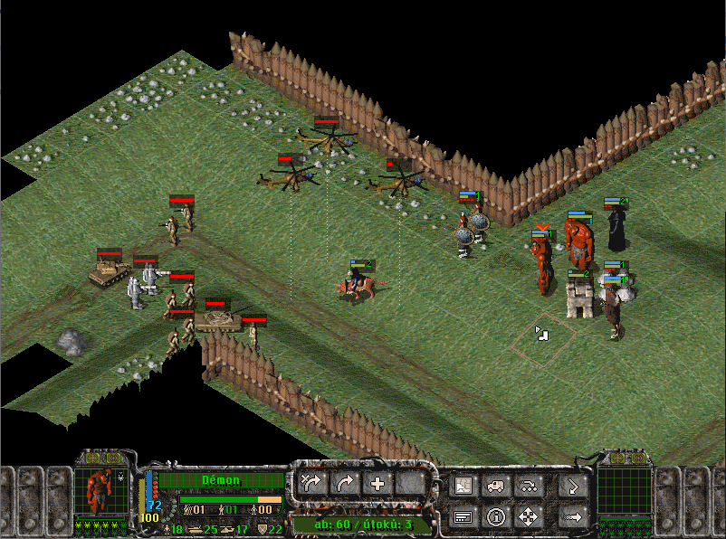
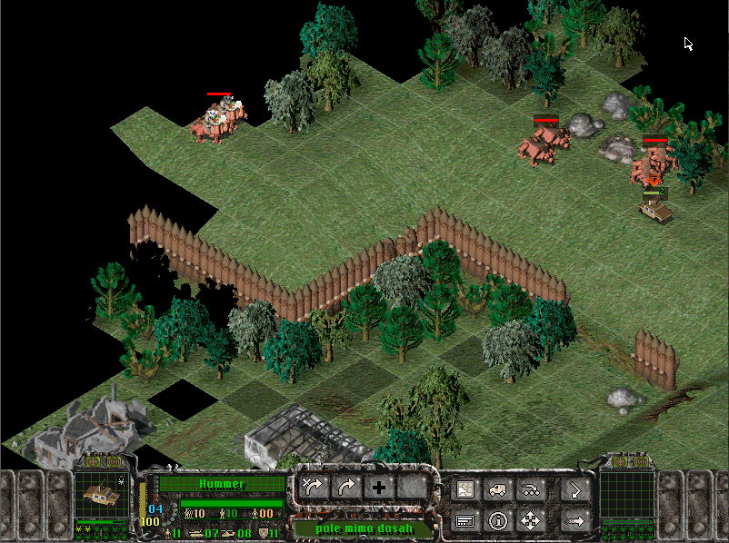

# Spellcross Mod Launcher

Simple tool for runtime building of Spellcross game archive mods and launching [Spellcross](https://en.wikipedia.org/wiki/Spellcross) game.

## What is it and why is it?

Spellcross is my favourite oldie game. Some 20+ years ago I started playing with the game data archives (*.FS and *.FSU files) and trying to decode and modify them. See some of my early experiments are [here](https://spellcross.kvalitne.cz/index.html) (sorry, Czech language only). 

However, when I wanted to make actual mods involving changes in several game archives and many files, it has become a bit impractical to do so manually by unpacking, editing files and repacking each archive again. The situation became even more convoluted when I had multiple different mods. So, I made a [tool](https://spellcross.kvalitne.cz/mod/spell_mod_builder.html) that can build modified game archives on runtime based on definition file from original game files and additional mod files to be added/modified. 
Then it can replace original game archives with modded ones, launch the game and of course restore original game archives after the game play is finished. 
Original tool was very messy and made in Borland VCL C++ which is now obsolete. So I spent few days and made the whole thing from a scratch again in MSVC C++ with wxWidgets GUI (in theory prepared for multiplatform builds). But soon I got many other ideas like randomizer functions, saves editor, etc. so the whole thing grew to be quite a capable tool.

## What can it do?

Here is brief list of things it can do:

- Current version is able to build modified game archives based on definition file same as the old tool.
- It can randomize unit types based on rules provided by my [Spellcross Map Editor](https://github.com/smaslan/spellcross-map-edit).
- It can force unit randomization using local rules.
- It can randomize trees in the maps to refresh the graphics a bit.
- It can swap the game archives with modded ones and restore them back.
- It can also move SAVE games folder along with the modded archives, so you can have separate set of saves for each mod not colliding with each other.
- It generates game launch batch files for either DOSbox mode or native Win32 mode. The Win32 is now obsolete but if compiled for x86 it can be run in e.g. 32bit WinXP which still has NTDVM emulator integrated.
- It can directly launch the game via DOSbox or Win32 modes - one click operation together with or without mod.
- It can make fast backup and restore of temporary WORKDIR save that is useful when you play some of the bloody mission where loss of special unit terminates mission without option to load (we all know those convoy missions right? :-).
- It has simple save game backup manager to make and restore backups of whole save games set just in case...
- It has experimental save game editor for inspecting and editing saves (can fix some of known game bugs).
- It has also simple game installer to bypass original 16-bit installer that requires manual mounting of game CD to DOSbox.
- It has integrated patcher for EN game engine that should work (unlike V1.01 patch).

## Randomizing units

Bored of same enemies every time? Use units randomizer. The tool works in conjunction with my experimental [Spellcross Map Editor](https://github.com/smaslan/spellcross-map-edit). It can either randomize map units using rules defined in the editor for each map or it can force randomization by rules set defined in this tool. This way you can e.g. swap Alliance and OS units and see how it goes.

## Randomizing trees

The visual of some maps is kind of boring. Especially the first three "grassy" levels. So I made a randomizer that allows you to create rules with probabilities that will replace trees in the maps every time you start the game.

## Save game editor

Got stuck in somewhere due to some game bugs? You run out of money? Or you just want to mess with your units beyond what game allows? Well, you can using the integrated save game editor. So far I was able to decipher about 95% of the level state stave `big_map.sav`. There are still a few items I cannot understand but those do not seem to be relevant to anything. Just make sure you have backups before you do anything! 

## Where to get some mods?

Well, apart from few [attempts](https://spellcross.kvalitne.cz/mod/spell_mod_builder.html) made for Czech version of the game there is one larger mod in development [here](https://github.com/smaslan/Spellcross-Mod-CZ-Hard). Apart from that, there is a mod template in the tool folder. That one should be sufficient to use the randomizers without changing anything else  

## Credits

The project uses few very useful external open source libraries:
- Spellcross Map Editor: shared Spellcross handling libraries ([https://github.com/smaslan/spellcross-map-edit](https://github.com/smaslan/spellcross-map-edit))
- wxWidgets: multiplatform graphical used interface ([https://github.com/wxWidgets/wxWidgets/](https://github.com/wxWidgets/wxWidgets/))
- simpleini: cross-platform library handling INI-style conf. files ([https://github.com/brofield/simpleini](https://github.com/brofield/simpleini))
- cparse: expression parser ([https://github.com/cparse/cparse](https://github.com/cparse/cparse))

## Building the project

If you like to make your own builds you certainly can. The project was made in pure C++20 in Microsoft Visual Studio 2019, so there should be no problem building it. The whole thing was made 100% using standard C++ libraries and a few multiplatform open source libraries listed above. The only hurdle is to properly link it with wxWidgets libraries. You have to download those and build them first, then set some system path variables and also change paths in the MSVC project file. That is always a bit of a mess when I start on a new PC. 

## Releases

Here are available release builds for 64-bit Windows. It was tested in Windows 10, but should work in Windows 11 as well. There is no installation, just download ZIP file, unpack it where you like it and run it. There may a bit issue with Windows 11 security setup though. So far I do not have certificate so I cannot build a signed trusted installer. This may result in problems with Windows "Smart App Control" or "App Install Control" or whatever it is called depending on your system setup. But I'm working on it!
Also, you can star my project here on GitHub if you like to help me out on a way to get the certificate.   

- [V1.0, 5th May 2026 (zip file)](./builds/Spellcross-Mod-Launcher-V1.0.zip)
  - First release (careful, not fully tested, make backups!).  
- [V1.1, 11th June 2026 (zip file)](./builds/Spellcross-Mod-Launcher-V1.1.zip)
  - Added save game editor (careful, not fully tested, make backups!).
- [V1.2, 15th August 2026 (zip file)](./builds/Spellcross-Mod-Launcher-V1.2.zip)
  - Added unit randomizer, mod options, fixed some bugs (careful, not fully tested, make backups!)
- [V1.3, 24th August 2026 (zip file)](./builds/Spellcross-Mod-Launcher-V1.3.zip)
  - Added local unit randomizer, added game installer, fixed some bugs (careful, not fully tested, make backups!).
- [V1.4, 30th August 2026 (zip file)](./builds/Spellcross-Mod-Launcher-V1.4.zip)
  - Added units and commanders addition/removal feature to savegame editor (careful, not fully tested, make backups!).
- [V1.42, 2nd September 2026 (zip file)](./builds/Spellcross-Mod-Launcher-V1.42.zip)
  - Added game patcher for EN game engine (careful, not fully tested, make backups!).
- [V1.43, 4th September 2026 (7zip file)](./builds/Spellcross-Mod-Launcher-V1.43.7z)
  - fixed save editor not updating some properties (careful, not fully tested, make backups!).

## Usage

The tool has [help](https://github.com/smaslan/Spellcross-Mod-Launcher/help/help_eng.html) in the application folder. It should be able to launch the HTML help via menu (it may fail due to Windows security policies). If not, open it manually using your browser.
 
                                 
## License
The tool is distributed under [MIT license](./LICENSE). 
  
