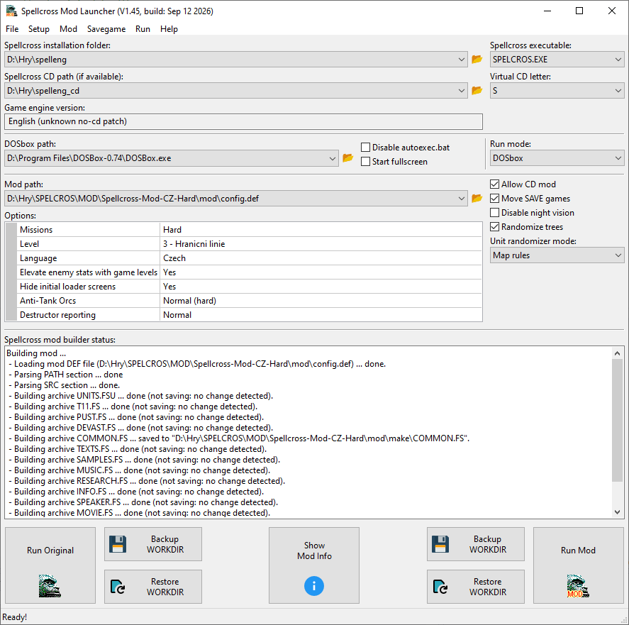
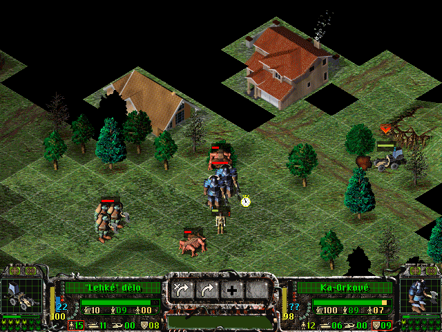
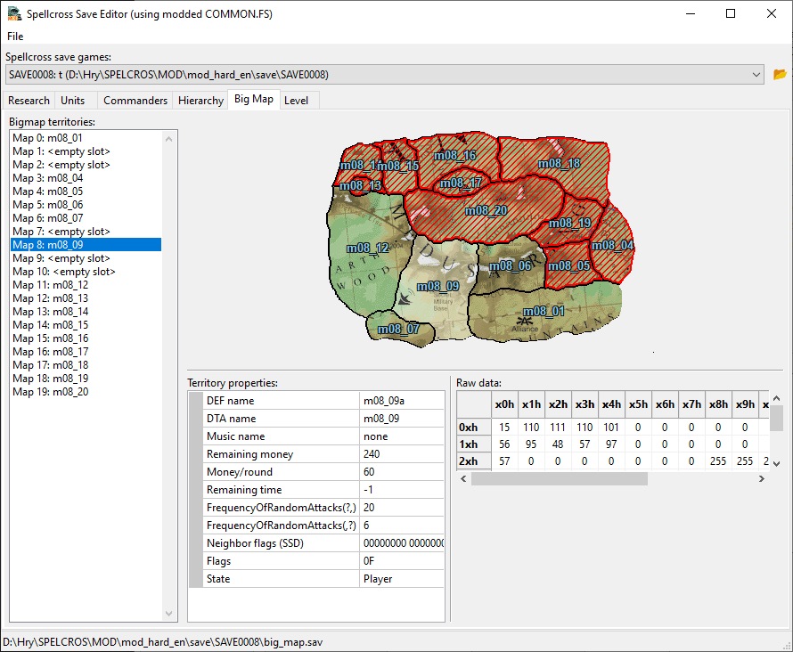

# Spellcross Mod Launcher

Simple tool for runtime building of Spellcross game archive mods and launching Spellcross game.

## What is it and why is it?

Spellcross is my favourite oldie game. Some 20 years ago I started playing with the game data archives (*.FS and *.FSU) and trying to decode and modify them. See some of my early experiments are 
[here](https://spellcross.kvalitne.cz/index.html) (sorry, Czech language only). 

However, when I wanted to make actual mods involving changes in several game archives, it has become a bit impractical to do so manually by unpacking, editing files and repacking each archive again. The situation became even more convoluted when I had multiple different mods. So, I made a [tool](https://spellcross.kvalitne.cz/mod/spell_mod_builder.html) that can build modified game archives on runtime based on definition file from original game files and additional user files to be added/modified. 
Then it can replace original game archives with modded ones, launch the game and of course restore original game archives after the game is finished. 
Original tool was very messy and made in Borland VCL C++ which is obsolete. So I spent few days and made the whole thing from a scratch again in MSVC C++ with wxWidgets GUI (in theory prepared for multiplatform builds).

## What can it do?

- Current version is able to build all game archives based on definition file same as the old tool.
- It can randomize unit types based on rules provided by my [Spellcross Map Editor](https://github.com/smaslan/spellcross-map-edit).
- It can swap the game archives with modded ones and restore them back.
- It can also move SAVE games folder along with the modded archives, so you can have separate set of saves for each mod not colliding with each other.
- It generates game launch batch files for either DOSbox mode or native Win32 mode. The Win32 is now obsolete but if compiled for x86 it can be run in e.g. 32bit WinXP which still has NTDVM emulator integrated.
- It can directly launch the game via DOSbox or Win32 modes - one click operation together with or without mod.
- It can make fast backup and restore of temporary WORKDIR save that is useful when you play some of the bloody mission where loss of special unit terminates mission without option to load (we all know those convoy missions right? :-).
- It has simple SAVE game backup manager to make and restore backups of whole save games set just in case...
- It has experimental SAVE game editor for inspecting and editing saves (can fix some of known game bugs).
- It has also simple game installer to bypass original 16-bit installer that requires manula mounting of game CD to DOSbox.
- It has integrated patcher for EN game engine that should work (unlike V1.01 patch).

## Builds

Here are available release builds for Windows. It was tested in Windows 10, but should work in Win11 as well. There is no installation, just download ZIP file, unpack it where you like it and run. 

- [V1.0, 5th May 2026 (zip file)](./builds/Spellcross-Mod-Launcher-V1.0.zip)
  - First release (careful, not fully tested, make backups!).  
- [V1.1, 11th June 2026 (zip file)](./builds/Spellcross-Mod-Launcher-V1.1.zip)
  - Added save game editor (careful, not fully tested, make backups!).
- [V1.2, 15th August 2026 (zip file)](./builds/Spellcross-Mod-Launcher-V1.2.zip)
  - Added unit randomizer, mod options, fixed some bugs (careful, not fully tested, make backups!)
- [V1.3, 24th August 2026 (zip file)](./builds/Spellcross-Mod-Launcher-V1.3.zip)
  - Added local unit randomizer, added game installer, fixed some bugs (careful, not fully tested, make backups!).
- [V1.4, 30th August 2026 (zip file)](./builds/Spellcross-Mod-Launcher-V1.4.zip)
  - Added units and commanders addition/removal feature to savegame editor (careful, not fully tested, make backups!).
- [V1.42, 2nd September 2026 (zip file)](./builds/Spellcross-Mod-Launcher-V1.42.zip)
  - Added game patcher for EN game engine (careful, not fully tested, make backups!).
- [V1.43, 4th September 2026 (7zip file)](./builds/Spellcross-Mod-Launcher-V1.43.7z)
  - fixed save editor not updating some properties (careful, not fully tested, make backups!).

## Uasge

The tool has help in the application folder. It should be able to launch the HTML help via menu (it may fail due to Windows security policies). If not, open it manually using your browser.
 
                                 
## License
The tool is distributed under [MIT license](./LICENSE). 
  
  
